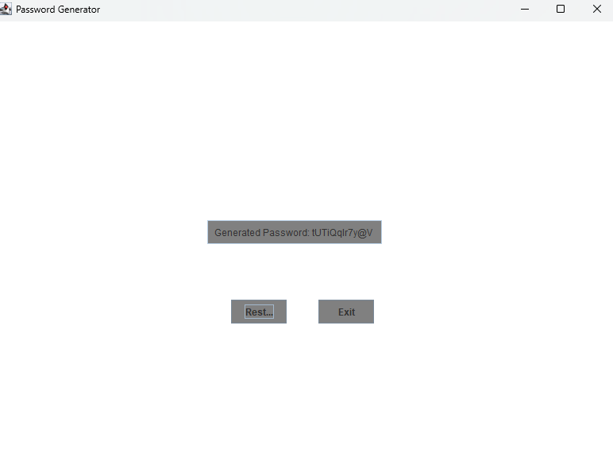

  

I created this project with the intention of putting it as one of my first few projects within my GitHub page. I wanted to put it here to showcase some of my skill as well as for future reference of how far I've come with my learning and ability. Password Generator itself is a simple project yet still took me a decent amount of time to create and problem-solve through. Throughout the process, I encountered various challenges that required me to think critically and refine my approach. Overcoming these obstacles not only strengthened my understanding of coding principles but also reinforced the importance of persistence and debugging. While it may seem like a small project, it represents a significant step in my journey as a developer, and I look forward to building even more complex applications in the future.
